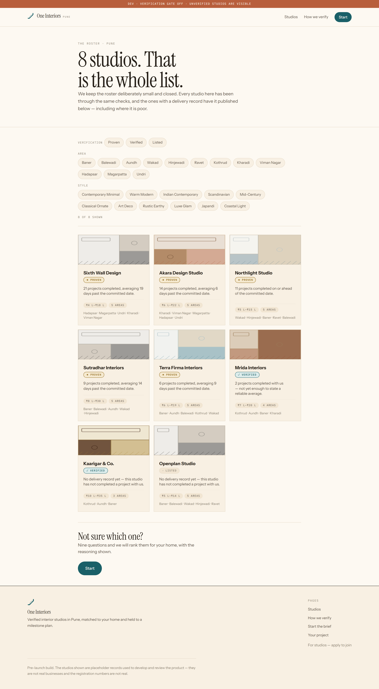
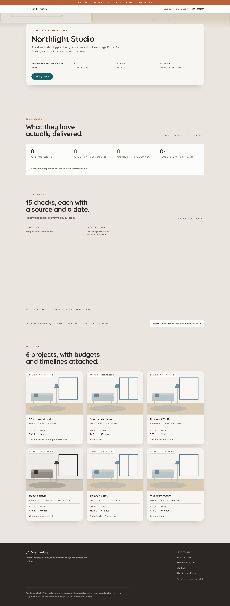
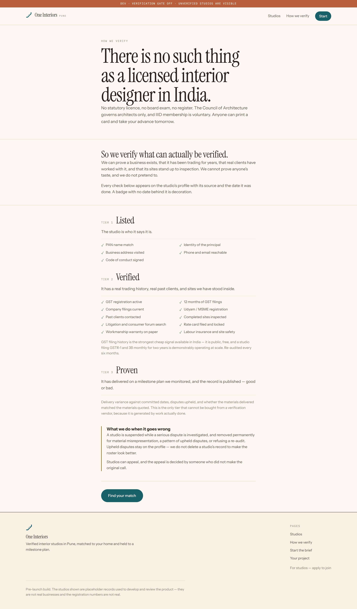
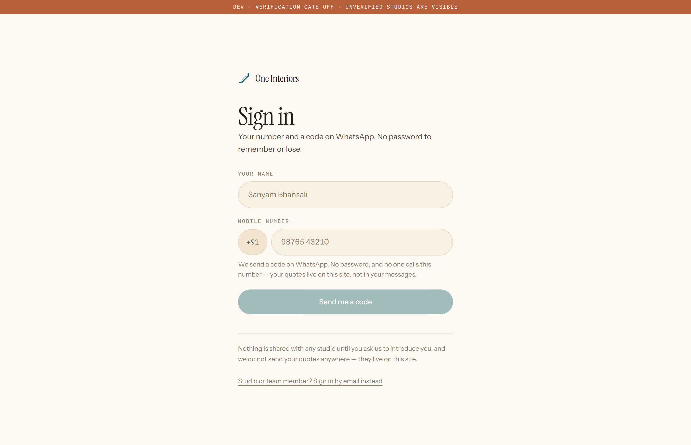
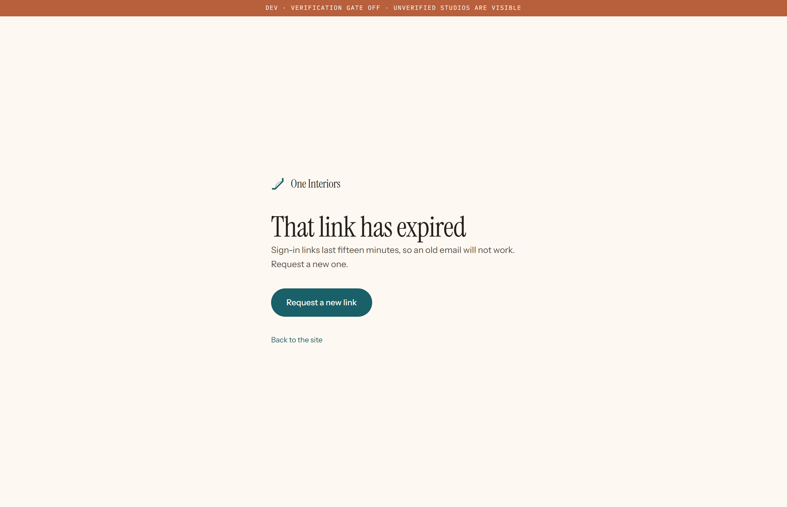
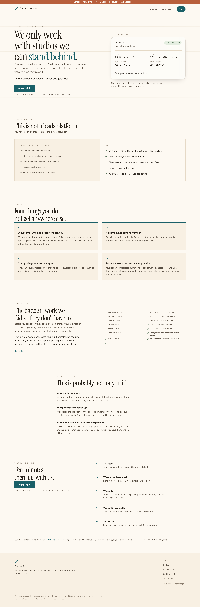

# Getting in

The pages anyone can reach: the marketplace front door, the two sign-in paths, and the form a studio applies through. Everything else in this folder set sits behind one of these.

Captured at phone width too — studio owners use this between site visits.

---

## 01 · The marketplace front door

**What it does.** The pitch: nine questions, studios that actually fit, a real quote from each, and an architect who checks every step. Scroll-driven — the how-it-works section pins a list of steps beside real product views rather than generic illustrations.

**Who sees it.** Anyone arriving at oneinteriors.in.

**Before → after.** A search, an ad, a friend. → The quiz, or the studio roster.

**Route.** `/`

**Needs.** Nothing. Renders with fixtures if the database is empty.

---

## 02 · Every studio on the roster

**What it does.** The full list, with what each has been verified on. Deliberately not ranked by anything a studio can pay for.

**Who sees it.** A customer browsing before committing to the quiz.

**Before → after.** The landing page. → A studio profile.

**Route.** `/studios`

**Needs.** Studios in the database. DEV_SHOW_UNVERIFIED_STUDIOS=1 shows the ones still onboarding.

---

## 03 · One studio, in public

**What it does.** Their work, their range, their localities, and the twelve checks with the state of each. The page a customer reads before deciding.

**Who sees it.** A customer.

**Before → after.** The roster, or a match. → Requesting a quote.

**Route.** `/studios/northlight-studio`

**Needs.** A studio with that slug. Swap the slug if your data differs.

---

## 04 · What "verified" actually means here

**What it does.** The twelve checks, spelled out, including what each one does NOT prove. The page that makes the badge mean something.

**Who sees it.** A sceptical customer, and every studio deciding whether to apply.

**Before → after.** A verification badge anywhere. → Back where they came from.

**Route.** `/verification`

**Needs.** Nothing.

---

## 05 · Sign in — customer

**What it does.** Name and mobile, then a code on WhatsApp. No password: a customer signs in rarely, and a forgotten password is one more wall between them and their quotes.

**Who sees it.** A customer returning for their quotes.

**Before → after.** Anything that needs an account. → Where they were going.

**Route.** `/sign-in`

**Needs.** Nothing. On studio. and ops. hosts this page shows the staff form instead.

---

## 06 · Sign in — studio and ops

**What it does.** Email and password first, because staff sign in to work and do it often. The emailed link sits directly underneath, never hidden, for a forgotten password or a first visit.

**Who sees it.** Studio owners and ops.

**Before → after.** Any staff page. → The studio dashboard or the console.

**Route.** `/sign-in`

**Needs.** Nothing to render. Shown by hostname, so capture uses the studio host header.

---

## 07 · That link has expired

**What it does.** Explains why rather than just failing: links last fifteen minutes and work once, and this page says so and offers another.

**Who sees it.** Anyone who opened a link too late.

**Before → after.** A stale email. → A fresh link.

**Route.** `/sign-in/verify?reason=expired`

**Needs.** Nothing — the reason is a query parameter.

---

## 08 · Choose a password

_Not captured._

**What it does.** Where a studio lands the first time they redeem their approval link. Thirty seconds, at the one moment we know they are reading something from us. Skippable.

**Who sees it.** A newly approved studio, and ops.

**Before → after.** The approval email. → Their dashboard.

**Route.** `/set-password?first=1`

**Needs.** A signed-in staff account with no password yet.

---

## 09 · A studio applies

**What it does.** The form a practice fills in to be considered. Asks for the things that decide it — years working, localities, range, what they have finished — and nothing else.

**Who sees it.** A design studio in Pune.

**Before → after.** An invitation, or the site. → Ops reviews it.

**Route.** `/apply`

**Needs.** Nothing.

---
