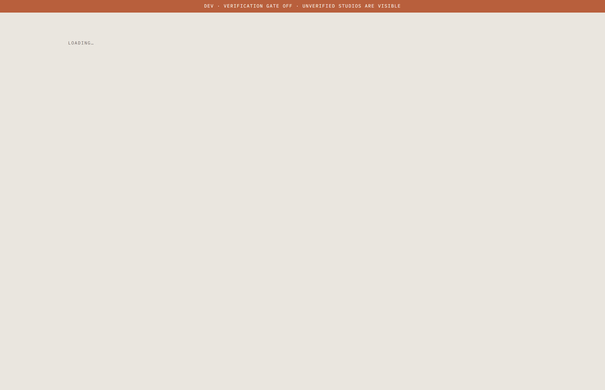
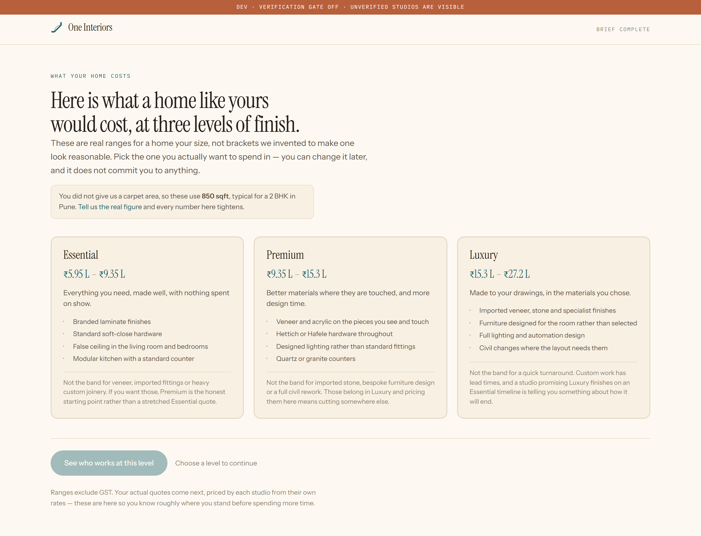
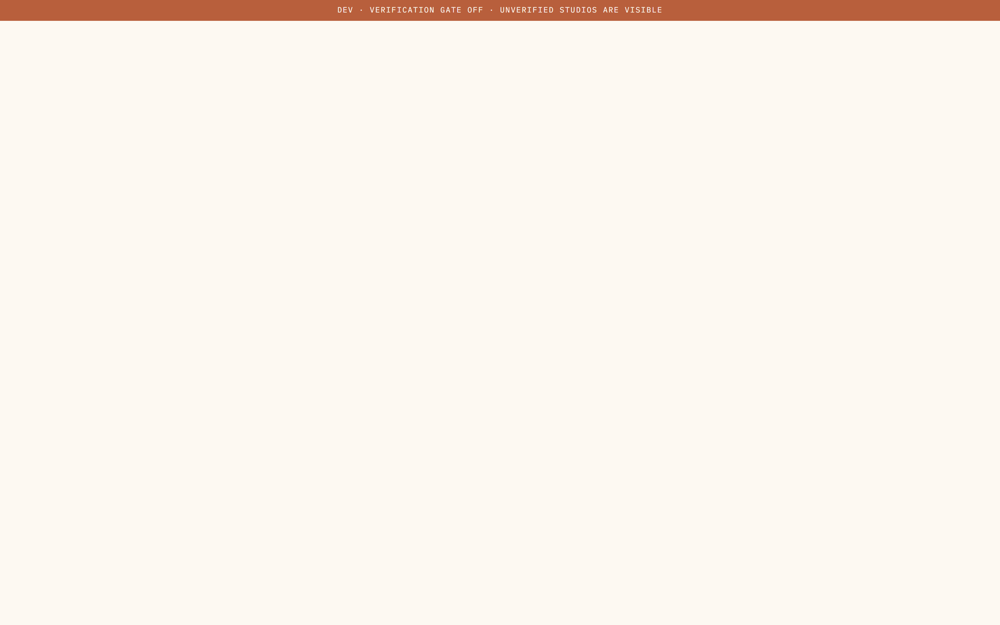
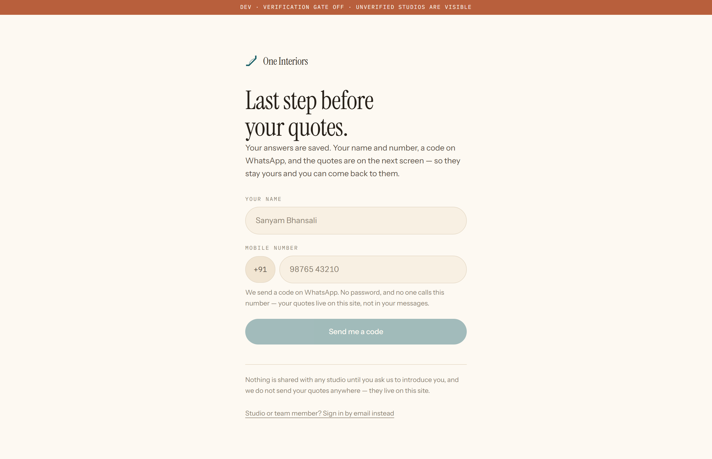

# The customer journey

A homeowner in Pune, from "I want to do up my flat" to holding three comparable quotes and an architect who has read them. Hidden behind the waitlist in production today — CUSTOMER_LIVE opens it.

Captured at phone width too — studio owners use this between site visits.

---

## 01 · Nine questions

**What it does.** The brief being written, a question at a time. Shows the answers accumulating and a live count of how many studios still match — so the customer sees their choices narrowing the field rather than filling a form.

**Who sees it.** A homeowner starting out.

**Before → after.** The landing page. → The tier estimate.

**Route.** `/quiz`

**Needs.** Nothing. Progress is kept per browser until they sign in.

---

## 02 · What this is likely to cost

**What it does.** An honest range from the brief, with what moves it up and down. Before any studio is involved, so the number is not anchored by whoever quoted first.

**Who sees it.** A customer who has finished the quiz.

**Before → after.** The quiz. → Their matches.

**Route.** `/tier`

**Needs.** A completed brief in the session.

---

## 03 · Who fits, and why

_Not captured._

**What it does.** Studios scored against the brief, each card showing the reason it matched and work that backs it. Cards open on scroll; verification ticks appear beside the projects in glass frames. Nobody can pay to sit higher, and the page says so.

**Who sees it.** A customer with a brief.

**Before → after.** The tier estimate. → Quotes.

**Route.** `/match`

**Needs.** A brief and studios with rate cards.

---

## 04 · The quotes arrive

_Not captured._

**What it does.** Generated from each studio's own rate card in about three seconds. No studio is asked, nobody is phoned. Line items carry quantity and spec, not a single lump sum.

**Who sees it.** A customer.

**Before → after.** Matches. → Comparing them.

**Route.** `/quotes`

**Needs.** A brief plus studios with rate cards — without those this is an empty state.

---

## 05 · Side by side, and the materials behind them

**What it does.** The quotes next to each other AND what each is actually made of — carcass, shutter, hardware. Tap any material to see what it means. This is where a cheaper quote stops looking cheaper.

**Who sees it.** A customer choosing.

**Before → after.** Quotes. → Asking for an architect.

**Route.** `/compare`

**Needs.** At least two quotes.

---

## 06 · Talk to an architect

**What it does.** Requesting the person who reads the quotes with them. Named, with their background — not a call centre.

**Who sees it.** A customer who wants a second opinion.

**Before → after.** Comparing. → The prep pack.

**Route.** `/expert`

**Needs.** Nothing to render the form.

---

## 07 · Before the call

_Not captured._

**What it does.** Three things to have ready: the floor plan, the rooms that matter, and what has already been decided. So the call starts at the real question.

**Who sees it.** A customer with a consultation booked.

**Before → after.** Requesting an architect. → The call.

**Route.** `/prepare`

**Needs.** A consultation request.

---

## 08 · Their account

_Not captured._

**What it does.** Their brief, their quotes, their consultations, and what we hold about them.

**Who sees it.** A returning customer.

**Before → after.** Signing in. → Anywhere.

**Route.** `/account`

**Needs.** A signed-in customer.

---

## 09 · A quote shared with someone else

_Not captured._

**What it does.** The read-only view when a customer sends a quote to a partner or parent. No account needed, and the link can be revoked.

**Who sees it.** Whoever the customer sent it to.

**Before → after.** A shared link. → Nothing — it is a leaf.

**Route.** `/shared/demo`

**Needs.** A real share token. Expect the not-found state unless you have one.

---
