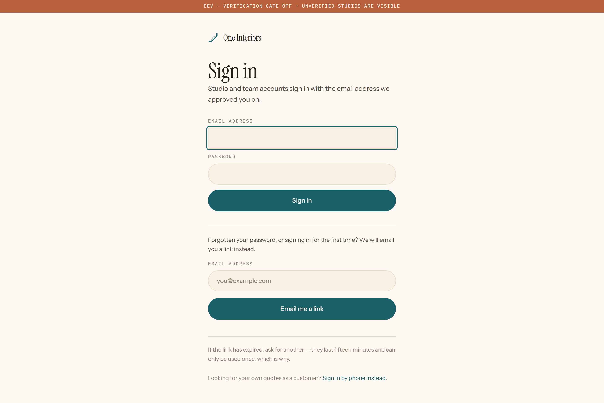

# The studio practice software

What a design studio gets: onboarding onto the roster, then the software they run their practice in — leads, projects, quotations, rates, their own public listing.

Captured at phone width too — studio owners use this between site visits.

---

## 01 · Onboarding 1 of 5 — profile

**What it does.** How they describe themselves, and where they work. The words a customer reads first.

**Who sees it.** An approved studio, working through about forty minutes of setup.

**Before → after.** The approval email and setting a password. → Step 2.

**Route.** `/studio/onboarding/profile`

**Needs.** A signed-in studio account still in ONBOARDING.

---

## 02 · Onboarding 2 of 5 — registration

**What it does.** GSTIN and registration numbers, checked against public records. Has an escape hatch — a practice without a GSTIN is not turned away at the door.

**Who sees it.** An approved studio, working through about forty minutes of setup.

**Before → after.** Step 1. → Step 3.

**Route.** `/studio/onboarding/registration`

**Needs.** A signed-in studio account still in ONBOARDING.

---

## 03 · Onboarding 3 of 5 — portfolio

**What it does.** Three completed projects. This is what customers actually read, and it is the step with no escape hatch — a genuinely new practice stops here.

**Who sees it.** An approved studio, working through about forty minutes of setup.

**Before → after.** Step 2. → Step 4.

**Route.** `/studio/onboarding/portfolio`

**Needs.** A signed-in studio account still in ONBOARDING.

---

## 04 · Onboarding 4 of 5 — rates

**What it does.** Their rate card. Private, never shown to anyone but them, and the thing every quote is generated from.

**Who sees it.** An approved studio, working through about forty minutes of setup.

**Before → after.** Step 3. → Step 5.

**Route.** `/studio/onboarding/rates`

**Needs.** A signed-in studio account still in ONBOARDING.

---

## 05 · Onboarding 5 of 5 — review

**What it does.** Send it to us. Then we check the registration, ring two past clients, and visit two finished sites.

**Who sees it.** An approved studio, working through about forty minutes of setup.

**Before → after.** Step 4. → Our verification, then going live.

**Route.** `/studio/onboarding/review`

**Needs.** A signed-in studio account still in ONBOARDING.

---

## 06 · The studio dashboard

**What it does.** What needs doing today — leads waiting, quotations to send, where each project stands. The morning screen.

**Who sees it.** A studio owner.

**Before → after.** Signing in. → Wherever the work is.

**Route.** `/studio`

**Needs.** A signed-in, active studio.

---

## 07 · Leads and clients

**What it does.** Every enquiry on a board with columns the studio defines themselves. A brand-new studio finds one sample lead here, clearly marked, removable, and excluded from every count.

**Who sees it.** A studio owner and their team.

**Before → after.** The dashboard. → A client record, or a quotation.

**Route.** `/studio/clients`

**Needs.** A signed-in studio. The sample lead seeds itself on an empty board.

---

## 08 · Bring your existing clients

**What it does.** CSV import, so a studio joining does not start from an empty board with a spreadsheet open beside it.

**Who sees it.** A studio in their first week.

**Before → after.** The board. → A full board.

**Route.** `/studio/clients/import`

**Needs.** A signed-in studio.

---

## 09 · The bin

**What it does.** Deleted clients, restorable for 30 days. Deleting a lead by accident should not be permanent.

**Who sees it.** A studio owner.

**Before → after.** Deleting something. → Restoring it.

**Route.** `/studio/clients/bin`

**Needs.** A signed-in studio. Empty unless something was deleted.

---

## 10 · Projects

**What it does.** Work that has been won, and where each one stands.

**Who sees it.** A studio owner.

**Before → after.** A client converting. → A project record.

**Route.** `/studio/projects`

**Needs.** A signed-in studio.

---

## 11 · The work pool

**What it does.** Tasks across projects and who they are assigned to.

**Who sees it.** A studio with a team.

**Before → after.** The dashboard. → Assigning something.

**Route.** `/studio/work`

**Needs.** A signed-in studio.

---

## 12 · Quotations

**What it does.** Every quotation the studio has raised, and its state.

**Who sees it.** A studio owner.

**Before → after.** The dashboard. → One quotation.

**Route.** `/studio/quotations`

**Needs.** A signed-in studio. Empty state unless quotations exist.

---

## 13 · The product master

**What it does.** What they build and what it costs them. New studios start from a neutral starter set rather than a blank table.

**Who sees it.** A studio owner.

**Before → after.** Setting up. → Quotations that price themselves.

**Route.** `/studio/products`

**Needs.** A signed-in studio.

---

## 14 · Rates

**What it does.** The rate card every generated quote comes from. Theirs to change, and private.

**Who sees it.** A studio owner.

**Before → after.** Onboarding step 4. → Live quotes.

**Route.** `/studio/rates`

**Needs.** A signed-in studio.

---

## 15 · Vendors

**What it does.** Who they buy from, and on what terms.

**Who sees it.** A studio owner.

**Before → after.** The product master. → Costing.

**Route.** `/studio/vendors`

**Needs.** A signed-in studio.

---

## 16 · Calendar

**What it does.** Site visits, client meetings, and the consultations we have introduced.

**Who sees it.** A studio owner.

**Before → after.** The dashboard. → A meeting.

**Route.** `/studio/calendar`

**Needs.** A signed-in studio.

---

## 17 · Their profile

**What it does.** Editing what customers read. Every word is theirs to approve before it goes live.

**Who sees it.** A studio owner.

**Before → after.** Onboarding. → Their public listing.

**Route.** `/studio/profile`

**Needs.** A signed-in studio.

---

## 18 · How they appear to customers

**What it does.** Their own listing as a customer sees it, plus where they stand on each of the twelve checks.

**Who sees it.** A studio owner.

**Before → after.** Their profile. → Fixing whatever is missing.

**Route.** `/studio/listing`

**Needs.** A signed-in studio.

---

## 19 · Settings — branding

**What it does.** Their logo and colours, which go onto the quotation PDF. The quote a client receives looks like the studio sent it, because they did.

**Who sees it.** A studio owner.

**Before → after.** Anywhere. → A branded quote.

**Route.** `/studio/settings`

**Needs.** A signed-in studio.

---

## 20 · Settings — pipeline

**What it does.** The columns on their board, named and coloured by them. Every practice runs differently and the software should not argue.

**Who sees it.** A studio owner.

**Before → after.** Settings. → A board that fits.

**Route.** `/studio/settings/pipeline`

**Needs.** A signed-in studio.

---

## 21 · Settings — custom fields

**What it does.** Extra fields on a client record, for whatever this studio tracks that we did not think of.

**Who sees it.** A studio owner.

**Before → after.** Settings. → Richer records.

**Route.** `/studio/settings/fields`

**Needs.** A signed-in studio.

---
