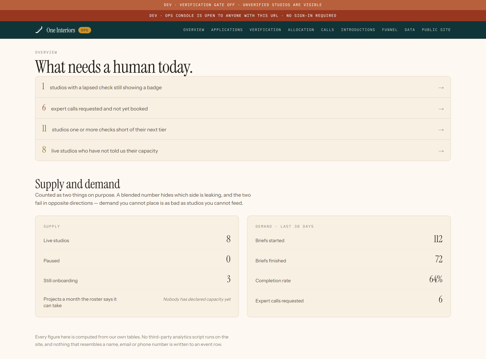
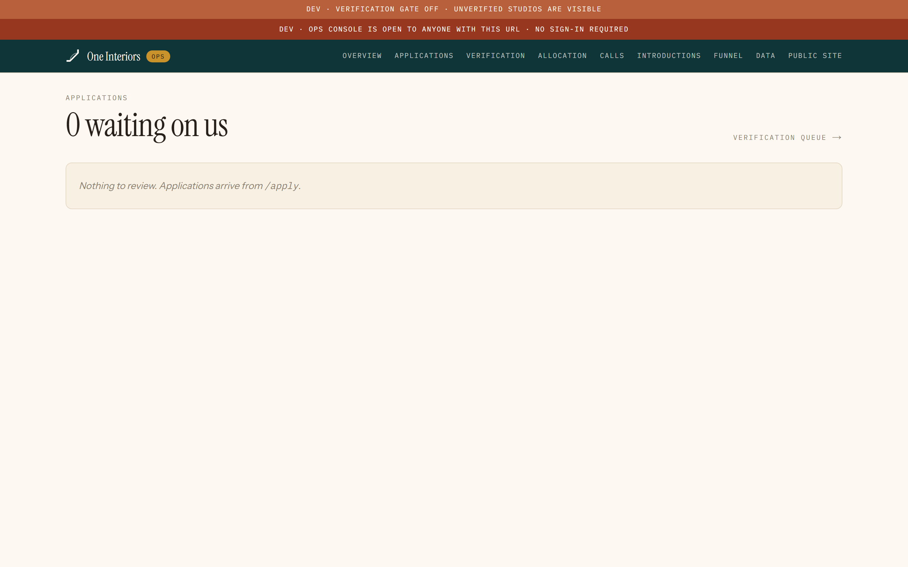
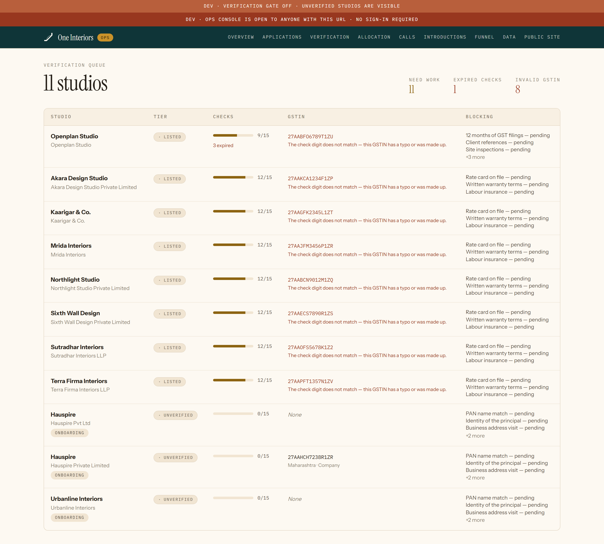
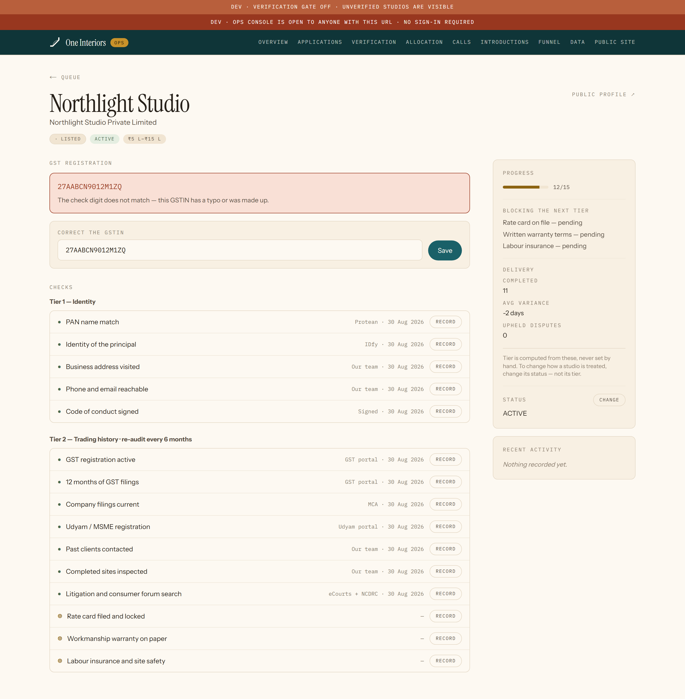
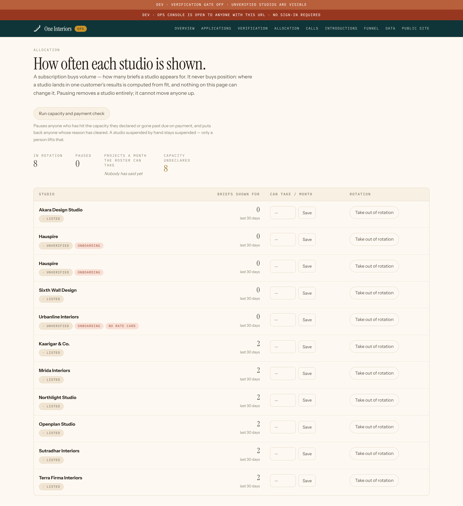
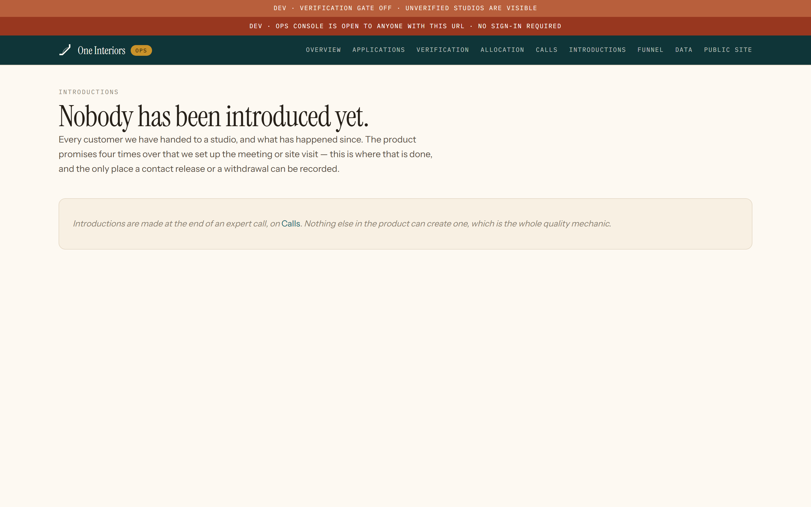
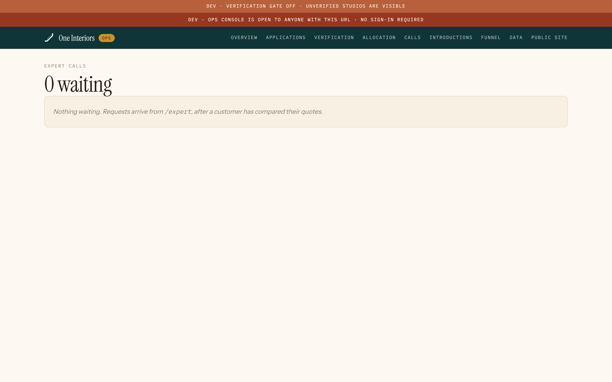
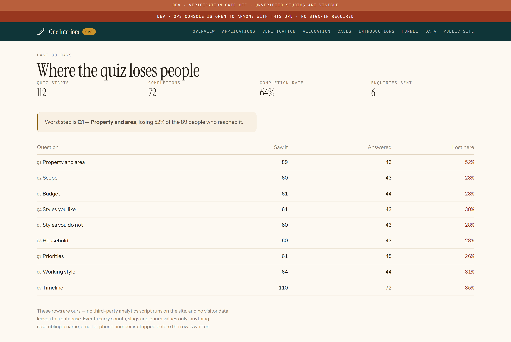
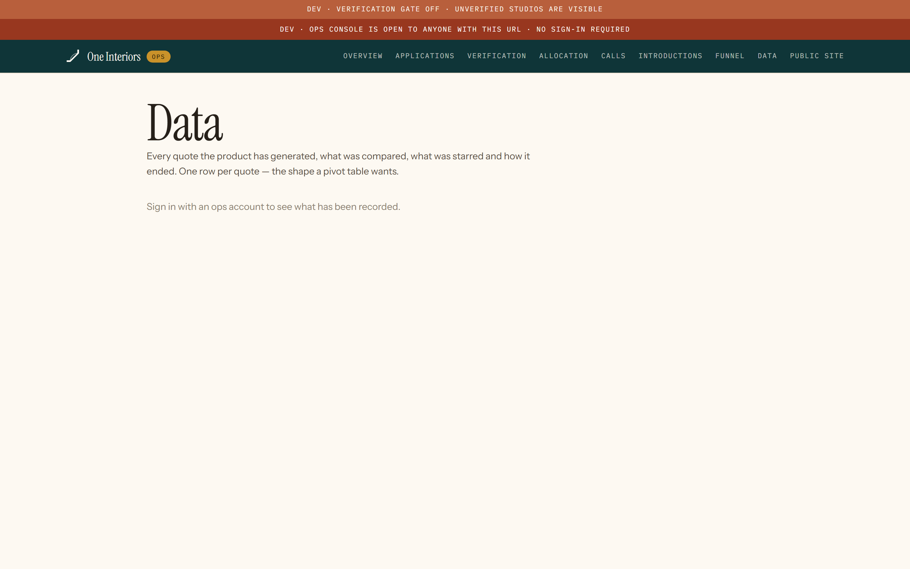

# The ops console

Yours. Who applied, who has been verified and how, which customer went to which studio, and what happened next.

Captured at phone width too — studio owners use this between site visits.

---

## 01 · The console

**What it does.** What needs your attention: applications waiting, verifications in progress, consultations to staff.

**Who sees it.** You.

**Before → after.** Signing in. → Whichever queue is longest.

**Route.** `/ops`

**Needs.** An ops account. DEV_OPS_NO_AUTH=1 opens it locally.

---

## 02 · Who has applied

**What it does.** Every application, with a button that reads their website and shows what it claims — labelled as claims, never as evidence. Approve creates the studio and emails them a sign-in link; reject requires a reason.

**Who sees it.** You.

**Before → after.** A studio applying. → Verification.

**Route.** `/ops/applications`

**Needs.** Applications in the database — npm run db:seed creates some.

---

## 03 · Verification

**What it does.** The twelve checks per studio and where each one stands. What has been proven, by whom, and when.

**Who sees it.** You.

**Before → after.** A studio submitting. → Going live.

**Route.** `/ops/verification`

**Needs.** Studios in verification.

---

## 04 · One studio, everything we know

**What it does.** Legal name, GSTIN, our own private assessment, their history with us. Not shown to anyone else, ever.

**Who sees it.** You.

**Before → after.** Any list. → A decision.

**Route.** `/ops/northlight-studio`

**Needs.** A studio with that slug.

---

## 05 · Allocation

**What it does.** How many briefs each studio is seeing, and the controls that shape it.

**Who sees it.** You.

**Before → after.** The console. → A fairer spread.

**Route.** `/ops/allocation`

**Needs.** Active studios.

---

## 06 · Introductions

**What it does.** Which customer was introduced to which studio, when, and what came of it.

**Who sees it.** You.

**Before → after.** A customer choosing. → Recording the outcome.

**Route.** `/ops/introductions`

**Needs.** Introductions in the database.

---

## 07 · Consultations

**What it does.** Architect calls requested and booked, each with the prep pack the customer filled in.

**Who sees it.** You and the architects.

**Before → after.** A customer asking. → The call.

**Route.** `/ops/consultations`

**Needs.** Consultation requests.

---

## 08 · The funnel

**What it does.** Where people arrive, where they stop, and how many get through each step.

**Who sees it.** You.

**Before → after.** The console. → Knowing what to fix.

**Route.** `/ops/funnel`

**Needs.** Analytics events. Thin on a fresh database.

---

## 09 · Export

**What it does.** Getting the data out in a shape you can think in, rather than reading it through a dashboard somebody else designed.

**Who sees it.** You.

**Before → after.** A question the console does not answer. → A spreadsheet.

**Route.** `/ops/data`

**Needs.** An ops account.

---
